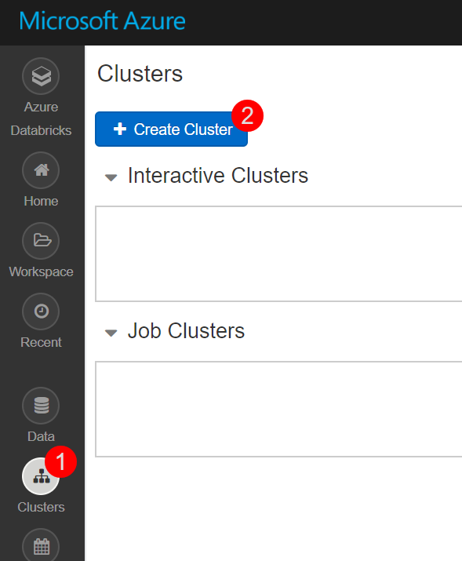

## Exercise 1: Retrieve lab environment information and create Databricks cluster

Duration: 10 minutes

In this exercise, you will retrieve your Azure Storage account name and access key and your Azure Subscription Id and record the values to use later within the lab. You will also create a new Azure Databricks cluster.

### Task 1: Retrieve Azure Storage account information and Subscription Id

You will need to have the Azure Storage account name and access key when you create your Azure Databricks cluster during the lab. You will also need to create storage containers in which you will store your flight and weather data files.

1. From the side menu in the Azure portal, choose **Resource groups**, then enter your resource group name into the filter box, and select it from the list.

2. Next, select your lab Azure Storage account from the list.

   

3. On the Overview blade, locate and copy your Azure **Subscription Id** and save to a text editor such as Notepad for later.

   

4. Select **Access keys** (1) from the menu. Copy the **storage account name** (2) and the **key1** key (3) and copy the values to a text editor such as Notepad for later.

   

### Task 2: Create an Azure Databricks cluster

You have provisioned an Azure Databricks workspace, and now you need to create a new cluster within the workspace. Part of the cluster configuration includes setting up an account access key to your Azure Storage account, using the Spark Config within the new cluster form. This will allow your cluster to access the lab files.

1. From the side menu in the Azure portal, select **Resource groups**, then enter your resource group name into the filter box, and select it from the list.

2. Next, select your Azure Databricks service from the list.

   

3. In the Overview pane of the Azure Databricks service, select **Launch Workspace**.

   

   Azure Databricks will automatically log you in using Azure Active Directory Single Sign On.

   

4. Select **Clusters** (1) from the menu, then select **Create Cluster** (2).

   

5. On the Create New Cluster form, provide the following:

   - **Cluster Name**: lab

   - **Cluster Type**: Standard

   - **Databricks Runtime Version**: Runtime: 5.5 (Scala 2.11, Spark 2.4.3) (**Note**: the runtime version may have **LTS** after the version. This is also a valid selection.)

   - **Python Version**: 3

   - **Enable Autoscaling**: Uncheck this option.

   - **Auto Termination**: Check the box and enter 120

   - **Worker Type**: Standard_F4s

   - **Driver Type**: Same as worker

   - **Workers**: 1

   - **Spark Config**: Edit the Spark Config by entering the connection information for your Azure Storage account that you copied above in Task 1. This will allow your cluster to access the lab files. Enter the following:

     `spark.hadoop.fs.azure.account.key.<STORAGE_ACCOUNT_NAME>.blob.core.windows.net <ACCESS_KEY>`, where <STORAGE_ACCOUNT_NAME> is your Azure Storage account name, and <ACCESS_KEY> is your storage access key.

   **Example:** `spark.hadoop.fs.azure.account.key.bigdatalabstore.blob.core.windows.net HD+91Y77b+TezEu1lh9QXXU2Va6Cjg9bu0RRpb/KtBj8lWQa6jwyA0OGTDmSNVFr8iSlkytIFONEHLdl67Fgxg==`

   

6. Select **Create Cluster**.